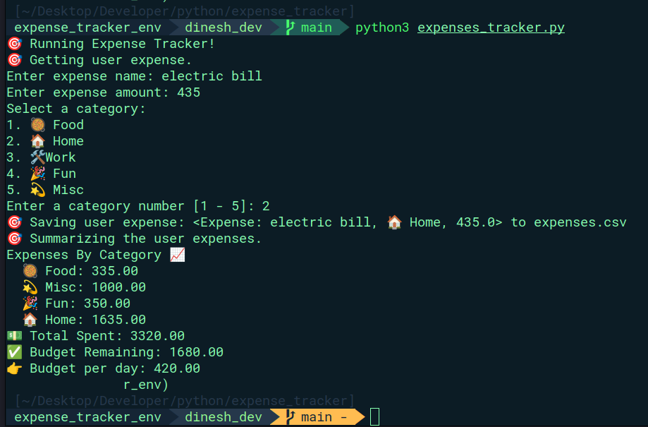

# Expense Tracker

Expense Tracker is a Python program that allows users to track their expenses and analyze their spending patterns. It provides functionality to record user expenses, save them to a file, and generate expense summaries.

## Features

- Record and save expenses: Users can enter the details of their expenses, including the name, amount, and category. The expenses are then saved to a file for future reference.

- Expense summaries: The program can generate summaries of the user's expenses, including the total spent, expenses by category, and the remaining budget.

- Budget per day calculation: The program calculates the budget per day based on the remaining budget and the number of days remaining in the current month.

## Installation

1. Clone the repository or download the project files to your local machine.

2. Ensure that Python 3 is installed on your system.

3. Install the required dependencies by running the following command:

   ```bash
   pip install pandas
   ```

## Usage

1. Run the program by executing the following command:

   ```bash
   python expense_tracker.py

   ```

2. Follow the prompts to enter the details of your expenses, such as the name, amount, and category.

3. The program will save the expenses to a file and display a summary of your expenses, including the total spent, expenses by category, and the remaining budget.

4. The program will also calculate the budget per day based on the remaining budget and the number of days remaining in the current month.

## Output Looks Like this.

More or like your output will look like this in the terminal (feel free to customize as your like)


## Contributing

Contributions to the Expense Tracker project are welcome! If you encounter any issues or have suggestions for improvements, please feel free to submit a pull request or open an issue.

## Acknowledgements

The Expense Tracker project was inspired by the need for a simple and efficient way to track and manage personal expenses.
